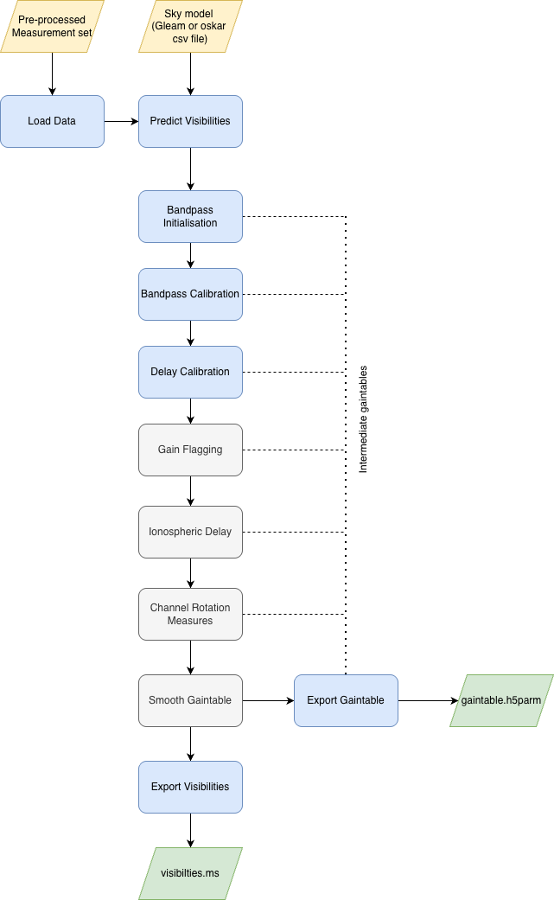

Calibation Strategy
===================

Calibation Strategy for Calibrator
----------------------------------

We came up with the current execution strategy for INST from the
`script <https://gitlab.com/ska-telescope/ssc/ska-ssc-low-comm-tools/-/blob/main/src/low_comm_tools/sdp/inst_mitch.py?ref_type=heads>`_
used by CommSci team to validate the read AA0.5 data.

.. note:: The other additional stages are currently turned off. You can toggle those on at any time based on user's preference.