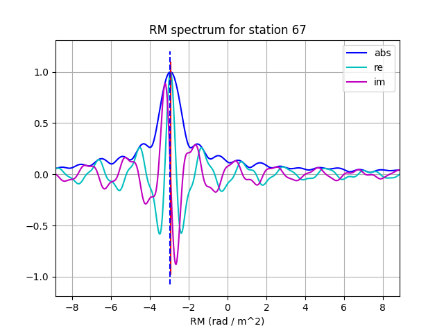

Overview of Pipelines
=====================

Instrumental calibration pipelines will need to be flexible to be useful for
both Mid and Low, but also to adapt as the array assemblies and our knowledge
of the instruments progress. They will also likely need to be able to work on
either dedicated calibration scans or target fields. However a few basic
workflows have been set up for use in the early array assemblies and to test
new data models and data handling approaches. Also to assess performance and
scaling.

Pipelines will by default create their own Dask cluster, but can instead be
passed an existing cluster scheduler_address. See the
`INST CI page <https://confluence.skatelescope.org/pages/viewpage.action?pageId=294236884>`_
for an example with a dask_jobqueue SLURMCluster.

Bandpass calibration
--------------------

The
:py:func:`~ska_sdp_instrumental_calibration.workflow.pipelines.bandpass_calibration`
pipeline has the following steps and is controlled by a configuration options
is a python dictionary. See
:py:class:`~ska_sdp_instrumental_calibration.workflow.pipeline_config.PipelineConfig`
for configuration options.

 * If called with `ms_name` set to "demo.ms", create a new test Measurement Set
   using
   :py:func:`~ska_sdp_instrumental_calibration.workflow.utils.create_demo_ms`
   that:

    * Uses the calibration model as the sky model. By default this is the
      GLEAMEGC sky model and EveryBeam beam models.
    * Adds complex Gaussian corruptions to station Jones matrices.
    * Does not add visibility sample noise. This could be added, but has been
      left out to check for precise convergence.
    * Writes to disk in MSv2 format.

 * Read the MSv2 data into Visibility dataset.\ :sup:`1`
 * Predict model visibilities.\ :sup:`1`
 * Do bandpass calibration.\ :sup:`1`
 * Apply calibration corrections to the corrupted dataset and check against
   the model dataset.\ :sup:`1`

\ :sup:`1` xarray dataset map_blocks() is used to distribute frequency
sub-bands across dask tasks.

The pipeline is demonstrated in three different ways in notebook
`demo_bpcal_pipeline.ipynb`. Once with only gain corruptions and a gain-only
solver for a simple user-defined sky model, then again using a sky model
generated automatically with GLEAM and EveryBeam, then again with gain and
leakage corruptions and a polarised solver.

Bandpass calibration with polarisation rotation
-----------------------------------------------

The
:py:func:`~ska_sdp_instrumental_calibration.workflow.pipelines.bandpass_polarisation`
pipeline is similar but has extra steps, including an intermediate,
post-calibration full-band fit for relative rotation of linear polarisation
between stations. With some testing and development this workflow may be a good
match for the needs of Low, but this initial version is also intended to show
some of the different options available. Other dedicated ionospheric solvers
are also available and will be demonstrated in other pipelines.

 * If called with `ms_name` set to "demo.ms", function
   :py:func:`~ska_sdp_instrumental_calibration.workflow.utils.create_demo_ms`
   is called with gain and leakage Jones matrix corruptions, as well as
   matrix rotations that increase with wavelength squared and change across the
   array.
 * Read the MSv2 data into Visibility dataset.\ :sup:`1`
 * Predict model visibilities with no knowledge of the rotations.\ :sup:`1`
 * Do bandpass calibration.\ :sup:`1` A polarised solver is used, but for some
   channels it is not fully converging. It is likely that the solutions are
   converging, but to local minima due to the range of large rotations (need to
   check how the func-python solvers declare convergence). In any case, the
   solutions are good enough for subsequent full-band fits. And these can be
   used to redo calibration with better starting conditions.
 * Function
   :py:func:`~ska_sdp_instrumental_calibration.processing_tasks.post_processing.model_rotations`
   is used to fit for a Rotation Measure that models the relative station
   polarisation rotations that increase linearly with wavelength squared.
   An example of the RM spectrum produced for one station is show below.
   The model RMs are used generate a pure rotation Jones dataset that can
   be used to better initialise calibration.
 * Do bandpass calibration again, starting with the new model Jones matrices.\
   :sup:`1`
 * Apply calibration corrections to the corrupted dataset and check against
   the model dataset.\ :sup:`1`

\ :sup:`1` xarray dataset map_blocks() is used to distribute frequency
sub-bands across dask tasks.

The pipeline is demonstrated in notebook `demo_bppol_pipeline.ipynb`.

Intermediate Sky Model
----------------------

The pipelines use an intermediate sky model containing relevant columns of a
sky catalogue. This can either be filled from a cone search of a user-supplied
GLEAMEGC file or CSV file, by a user-defined list of
:py:class:`~ska_sdp_instrumental_calibration.processing_tasks.lsm.Component`
objects, or in the near future from a query of the
`Global Sky Model <https://developer.skao.int/projects/ska-sdp-global-sky-model/en/>`_
service (which in practice may be called outside this pipeline, with output
added to the Telescope Model).

The intermediate data model consists of:

 * Component name and position (right ascension and declination in degrees).
 * The flux density, reference frequency and spectral index.
 * If available, the elliptical Gaussian parameters from a fit to the component
   shape.
 * If the component shape includes the synthesised or restoring beam, the
   elliptical Gaussian parameters from a beam fit can also be supplied and will
   be deconvolved before setting the final Local Sky Model.

See data class
:py:class:`~ska_sdp_instrumental_calibration.processing_tasks.lsm.Component`
for more information.

For example, to add GLEAMEGC data by hand, a user would do the following:

.. code-block:: python

  bandpass_calibration.run(
      {
          "dask_scheduler_address": cluster.scheduler_address,
          "fchunk": fchunk,
          "ms_name": "3C444.ms",
          "lsm":[
              Component(
                  name="3C444",
                  RAdeg=333.606415, DEdeg=-17.027868,
                  flux=57.429787, ref_freq=200e6, alpha=-0.983667,
                  major=159.167, minor=134.599, pa=-0.544577,
                  beam_major=132.317, beam_minor=130.051, beam_pa=-24.284771
              ),
          ],
          "beam_type": "none",
          "h5parm_name": "3C444.h5",
      }
  )

The beam elliptical Gaussian will be deconvolved from the component elliptical
Gaussian, which in this cases results a component shape of 1.48' x 0.55' at a
PA of 1.29 degrees. However this source resolves into multiple components, and
a user could instead use the two components from NVSS:

.. code-block:: python

  bandpass_calibration.run(
      {
          "dask_scheduler_address": cluster.scheduler_address,
          "fchunk": fchunk,
          "ms_name": "3C444.ms",
          "lsm":[
              Component(
                  name="3C444North",
                  RAdeg=333.603875, DEdeg=-17.016722,
                  flux=4.2286, ref_freq=1.4e9, alpha=-0.983667,
                  major=31.5, minor=20.8, pa=-32.6,
              ),
              Component(
                  name="3C444South",
                  RAdeg=333.608500, DEdeg=-17.039008,
                  flux=4.6849, ref_freq=1.4e9, alpha=-0.983667,
                  major=33.6, minor=21.9, pa=-3.6,
              ),
          ],
          "beam_type": "none",
          "h5parm_name": "3C444.h5",
      }
  )

The NVSS elliptical Gaussian parameters have already been deconvolved, so no
beam information should be given. NVSS does not include spectral index
information, so the GLEAMEGC value has been used -- extrapolating the GLEAMEGC
parameters to 1.4 GHz results in 8.5 Jy, which is roughly consistent with the
combined NVSS flux.

Or to use GLEAMEGC and EveryBeam:

.. code-block:: python

  bandpass_calibration.run(
      {
          "dask_scheduler_address": cluster.scheduler_address,
          "fchunk": fchunk,
          "ms_name": "3C444.ms",
          "gleamfile": "gleamegc.dat",
          "fov": 10,
          "flux_limit": 1,
          "eb_coeffs": "ska-sdp-func-everybeam/coeffs",
          "h5parm_name": "3C444.h5",
      }
  )

Similar functionality is available using a CSV sky component file of the type
used in OSKAR, using option `csvfile` instead of `gleamfile`.
